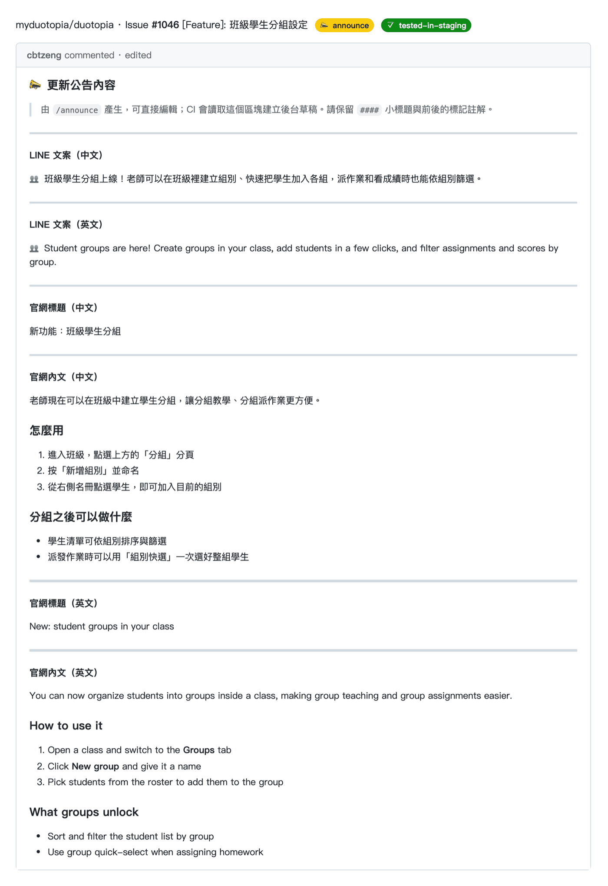
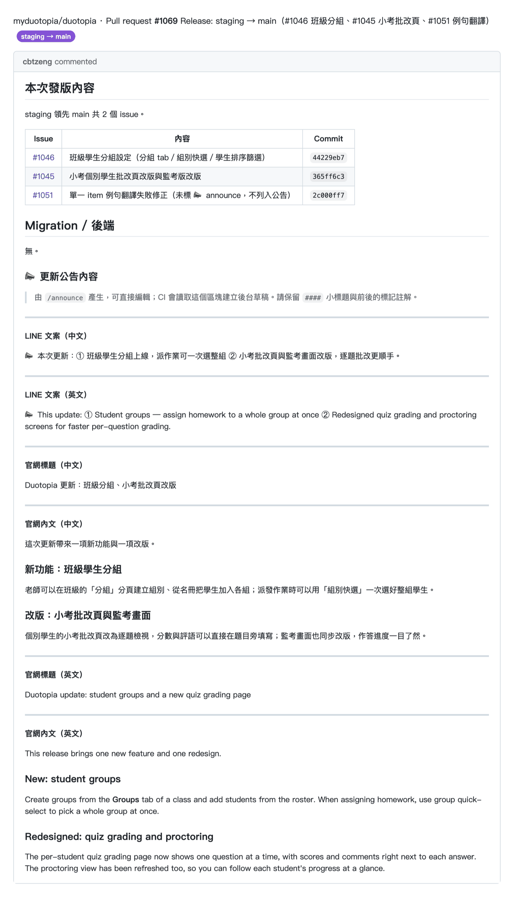
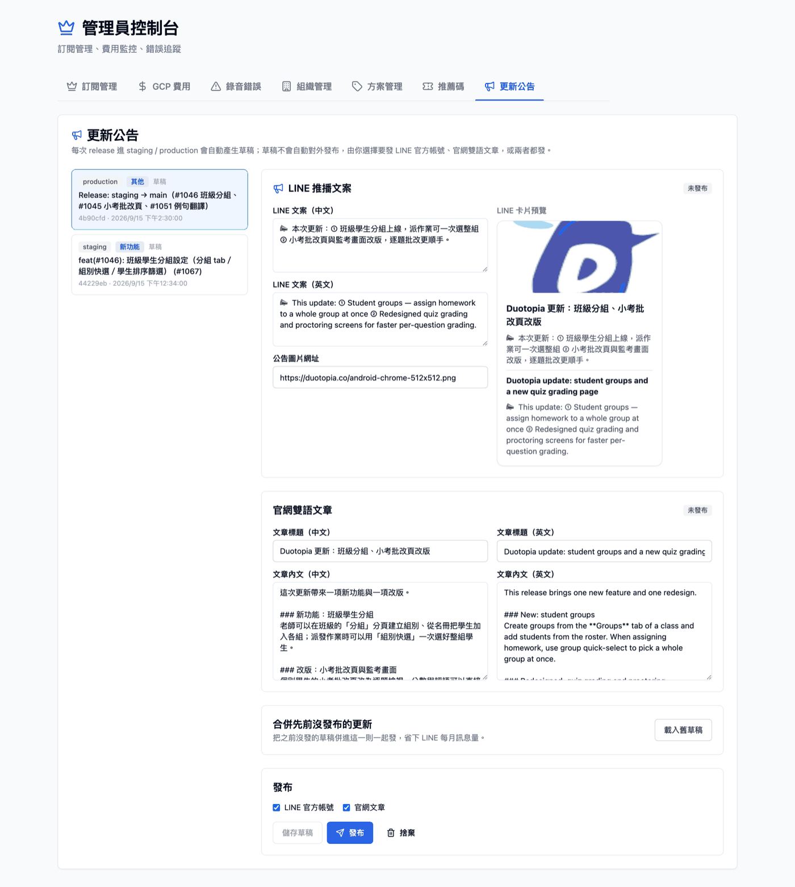

# 更新公告設定指南（LINE 官方帳號 + 官網文章）

> issue #804。系統設計見 [`docs/design/issue-804-release-announcements.md`](../design/issue-804-release-announcements.md)。

更新公告會把 release 內容整理成兩份：**LINE 官方帳號推播**與**官網中英文章**。
草稿由 CI 自動建立，**一律要管理者在後台按「發布」才會對外**。

---

## 1. 需要設定的 secret / variable

設定位置：GitHub repo → **Settings → Secrets and variables → Actions**。

### 更新公告專用

| 名稱 | 種類 | 值從哪裡來 | 用哪種帳號取得 | 什麼時候用 | 用在誰身上 |
|------|------|-----------|---------------|-----------|-----------|
| `RELEASE_WEBHOOK_SECRET` | Secret（**必填**） | 自己產生：`openssl rand -hex 32` | 不需要 LINE 帳號；有 GitHub repo 管理權限的人設定 | 每次 push `staging` / `main`，CI 呼叫後端建立草稿 | GitHub Actions ↔ 我們的後端（內部驗證，未設定時不會建立任何草稿） |
| `LINE_ANNOUNCE_CHANNEL_ACCESS_TOKEN` | Secret（要發 LINE / 收通知才需要） | LINE Developers → 官方帳號的 Messaging API channel → **Messaging API** 分頁 → Channel access token (long-lived) → Issue | **官方帳號**：必須是 Duotopia 官方 LINE 帳號的 Messaging API channel，由對官方帳號有管理權限的人登入取得 | 草稿建立時的通知、後台按「發布」並勾選 LINE | production 發布：**broadcast 給官方帳號的所有好友**；其他情況只推給下一列的審核者 |
| `LINE_ANNOUNCE_USER_ID` | Secret（要收草稿通知 / 在 staging 測 LINE 才需要） | 審核者的 user ID（`U` 開頭 33 字元）：本人可在同一個 channel 的 **Basic settings → Your user ID** 取得；他人需透過 webhook 事件的 `source.userId` 取得 | **個人帳號**：公告審核者，且要先把官方帳號加為好友 | ① staging / production **建立草稿時**推「待審核」通知 ② staging 按「發布」勾選 LINE | 只推給這一個人（staging 發布的卡片標題加 `[STAGING]`），不會打擾真實粉絲 |
| `RELEASE_ANNOUNCEMENT_BANNER_URL` | Variable（選填） | 公告樣板圖的 `https://` 網址 | 不需要 LINE 帳號 | 建立草稿時當預設圖片 | LINE 卡片主圖、官網文章封面（未設定時用官網圖示佔位） |

> **為什麼審核者 ID 要另外設？** LINE 的 user ID **依 provider 不同**。
> CI 通知 bot 的 `LINE_USER_ID` 屬於另一個 provider，拿官方帳號的 token 推給它會失敗。

### 維持不動（CI 通知 bot，和粉絲無關）

| 名稱 | 誰的帳號 | 用途 |
|------|---------|------|
| `LINE_CHANNEL_ACCESS_TOKEN` | 開發團隊的 CI 通知 bot（個人或團隊帳號） | Release PR 建立、CI 結果推播給開發者 |
| `LINE_USER_ID` | 開發者本人 | 上述 CI 通知的收件人 |
| `LINE_CHANNEL_SECRET` | CI 通知 bot | 目前沒有任何程式使用 |

更新公告**只讀 `LINE_ANNOUNCE_*`**，絕不會拿 CI 通知 bot 的 token 去 broadcast。
未設定時，後台發 LINE 會顯示「尚未設定官方帳號」，官網文章仍可正常發布。

---

## 2. 建立官方帳號的 Messaging API channel

> ⚠️ LINE Developers 裡有 **Developing / Review / Published 三組 Channel ID** 的是 **LINE MINI App**，
> 不能用來推播。要用的是只有一組 ID、帶有 **Messaging API** 分頁的 channel。

1. 用**對 Duotopia 官方帳號有管理權限**的 LINE 帳號登入
   [LINE Official Account Manager](https://manager.line.biz/)。
2. 選 Duotopia 官方帳號 → **設定 → Messaging API → 啟用 Messaging API**，選擇 provider。
   provider 選定後**不能更改**，而且 user ID 會跟著 provider 走，請團隊統一用同一個。
3. 到 [LINE Developers Console](https://developers.line.biz/console/) → 該 provider →
   剛啟用的 channel：
   - **Messaging API** 分頁最下方 → Channel access token (long-lived) → **Issue**
     → 存成 `LINE_ANNOUNCE_CHANNEL_ACCESS_TOKEN`
   - 審核者的 user ID → 存成 `LINE_ANNOUNCE_USER_ID`（這個人要先用手機把官方帳號加為好友）
     - 審核者是登入 LINE Developers 的本人：**Basic settings** 分頁 → **Your user ID**
     - 審核者是其他人：請對方加好友或傳一句話給官方帳號，從 webhook 事件的 `source.userId` 取得
4. 產生 webhook 密鑰並存成 `RELEASE_WEBHOOK_SECRET`：
   ```bash
   openssl rand -hex 32
   ```
5. secret 會在**下一次部署後端**時帶進 Cloud Run（push `staging` 或 `main`）。

### 怎麼確認已經設定

```bash
gh secret list | grep -E "LINE_|RELEASE_"
```

GitHub 只會顯示**名稱與最後更新時間**，看不到值（設計如此）。
值是否有效可以這樣確認：

- `RELEASE_WEBHOOK_SECRET`：push staging 後，Actions 的「Release Announcement Draft」
  不再出現「缺少 RELEASE_WEBHOOK_SECRET」，而是「草稿已建立」或「略過：…」。
- `LINE_ANNOUNCE_*`：建立草稿時審核者會收到「📝 新的更新公告草稿待審核」通知；
  或在 staging 後台對一則草稿只勾 LINE 發布，審核者收到 `[STAGING]` 卡片，即代表 token 與 user ID 都正確。

---

## 3. 日常使用流程

```
開發 issue ──────────────────────────────────────────────────────────────
  issue 加上 📣 announce（需要對外公告的才加）
  測試通過 → 加上 ✅ tested-in-staging → CI 自動開進 staging 的 Release PR
  在合併該 Release PR 之前：/announce #N
      └─ Claude Code 讀 issue + 改動 → 產生中英文內容 → 寫成 issue 留言（圖①）

push staging（合併 Release PR）
  └─ CI：兩個標籤都有 → 讀 issue 留言 → 建立 staging 草稿（不呼叫 Vertex）
         → LINE 推「待審核」通知給 LINE_ANNOUNCE_USER_ID
         沒有留言 → 退回「解析 release 標題 → Vertex AI」
         沒有 issue 編號 / 標籤不齊 → 不建草稿

準備上 production：/announce release（或跟 Claude Code 說「開 staging → main 的 PR」）
  └─ 掃描 main..staging 的 issue → 只取兩個標籤都有的 → 缺留言的當場補產
     → 統整成一則 → 寫進 staging → main PR 描述（圖②；沒有 PR 就一起開）

push main（合併 staging → main PR）
  └─ CI：讀 PR 描述的統整區塊 → 建立 production 草稿
         → LINE 推「待審核」通知給 LINE_ANNOUNCE_USER_ID

管理者後台 /admin →「更新公告」（圖③）
  └─ 確認 / 修改內容 → 勾選 LINE、官網 → 發布
       （production：broadcast 給所有好友；staging：只推給 LINE_ANNOUNCE_USER_ID）
```

- **沒有 `📣 announce` 標籤 = 不需要發布**，CI 不會建立草稿。
- `/announce` 會拒絕還沒有 `✅ tested-in-staging` 的 issue。
- issue 留言與 PR 描述裡的內容都可以直接在 GitHub 上修改，CI 讀的是修改後的版本。
  請保留 `####` 小標題與 `<!-- release-announcement:* -->` 標記。

### 圖① issue 留言（`/announce #N`）



### 圖② staging → main PR 描述（`/announce release`）



### 圖③ 後台「更新公告」頁



> 截圖以範例資料產生：圖①② 由 GitHub 官方 markdown API 渲染，圖③ 為本機後台畫面。
